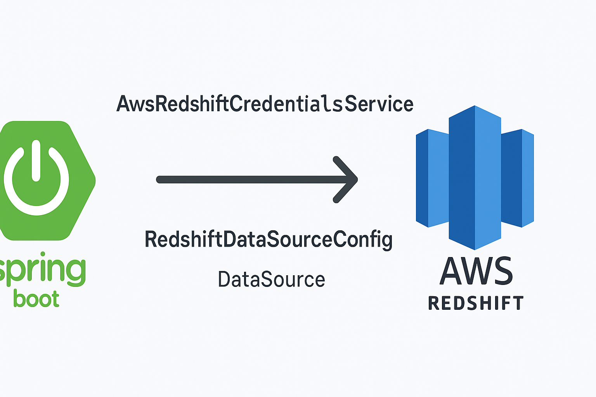
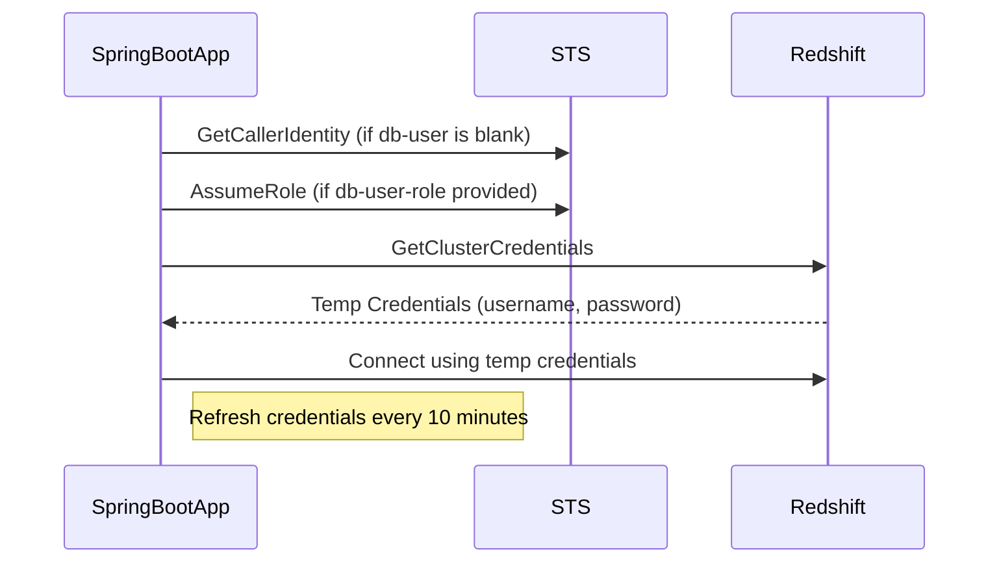

# Redshift IAM Authentication with Spring Boot

This project demonstrates how to connect a Spring Boot application to an **Amazon Redshift** cluster using **temporary IAM credentials** (rather than a static password). It supports **dynamic credential rotation**, **secure access via IAM**, and includes an HTTP endpoint to trigger Redshift queries.



## 🌱 Features

- 🔐 IAM-based authentication to Redshift (no password storage!)
- 🔁 Automatic rotation of credentials every 10 minutes
- 👥 Supports IAM roles for Redshift authentication
- ☁️ Integration with AWS SDK v2 (Redshift & STS)
- 🧪 Local dev support via `awsume` or any configured AWS profile
- 🔍 Lightweight HTTP endpoint to validate access to Redshift
- ✅ Compatible with Spring Boot 3.x and Java 21+

---

## 🚀 Getting Started

### Prerequisites

- AWS Redshift Cluster with IAM authentication enabled
- A Redshift database user that matches your IAM principal or is auto-creatable
- An IAM role or user with `redshift:GetClusterCredentials` permissions
- Java 21 and Gradle

You’ll also need network access to the Redshift cluster (either via VPC routing or a public endpoint).

---

## 🏗️ How it works

1. On startup, Spring Boot loads `AwsRedshiftCredentialsService`.
2. This uses the AWS SDK to call `GetClusterCredentials` using the **IAM principal**.
3. A temporary Redshift user password is returned.
4. The Hikari connection pool is created using those credentials.
5. Every 10 minutes, the credentials are rotated.

---

## ⚙️ Configuration (application.yml)

```yaml
redshift:
  cluster-id: your-cluster-id
  db-name: your-db-name
  region: your-aws-region
  db-user: your-redshift-user # optional - defaults to IAM caller
  db-user-role: your-assumable-role-arn # optional - used to assume a role before fetching credentials
  host: your-redshift-cluster-hostname # optional - skip DescribeClusters if provided
  port: 5439 # optional - default is 5439
```

---

## 🔐 Required IAM Permissions

| Action                         | Required For                                       |
|--------------------------------|----------------------------------------------------|
| redshift:GetClusterCredentials | Always required to obtain temporary credentials    |
| redshift:DescribeClusters      | Optional - only needed if `host` is not configured |
| sts:AssumeRole                 | Only if `db-user-role` is provided in config       |

---

## 🧪 Local Development

You can test locally using [awsume](https://awsu.me) or any other AWS credential mechanism.

```bash
awsume your-role
./gradlew bootRun
```

---

## 🔁 Credential Refresh

Credentials are rotated using Spring’s `@Scheduled` every 10 minutes.

This allows long-running services to maintain a valid Redshift connection pool even with short-lived IAM credentials.

---

## 🔍 Endpoint

Hit `http://localhost:8080/process-end` to verify the connection.

Example response:

```json
{
  "currentDateTime": "2025-03-30T11:36:43.593404",
  "status": "success",
  "processEndDate": "2025-03-28"
}
```

---

## 📊 Mermaid Diagram



---

## 🤔 FAQ

**Q: Do I still need to create a Redshift user?**

Yes, either:

- Pre-create the user with the matching IAM name, or
- Allow Redshift to `autoCreate` the user via IAM policy

**Q: What happens if I forget to rotate credentials?**

Your connection pool will start to fail after the credentials expire. This setup avoids that by rotating every 10 minutes.

**Q: Why is this better than storing Redshift passwords?**

You don’t store secrets at all. The password is generated securely on-the-fly by AWS.

**Q: Can I assume a different IAM role before getting credentials?**

Yes — specify the `db-user-role` in `application.yml`, and the app will first assume that role before calling `GetClusterCredentials`.

---

## 👨‍👩‍👧 Contributors

Built by [@garrywilliams](https://github.com/garrywilliams) for experimentation and future production usage with dynamically authenticated Redshift connections in Spring Boot.
